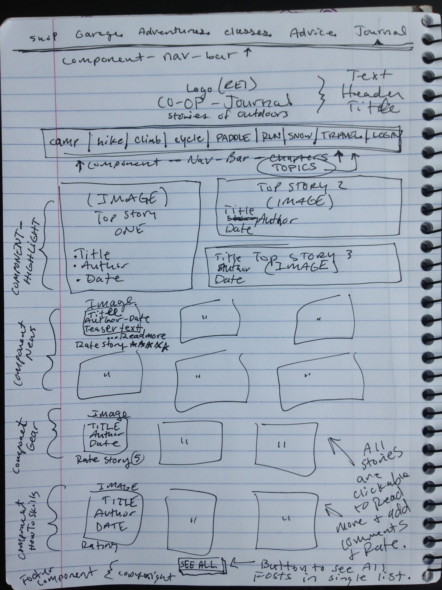

# REI Journal
Remake of [REI Co-op Journal](https://www.rei.com/blog), generated with [Angular CLI](https://github.com/angular/angular-cli) version 1.7.3. May 2018, Robin Sola.

Check out the live site: http://rei-journal.firebaseapp.com

## Description
The REI Co-op Journal is a blog type website where members can share their stories and knowledge on a number of outdoor lifestyle topics, including camping, climbing, snow sports, travel, and more. Blog members are able to log into the website, read news stories, how-to articles, and about top-rated gear related to any of the outdoor topics. Members can also post comments and give ratings each of the stories they read.

## Planning
> As a user, I want to see a list of outdoor lifestyle topics so I can choose one to focus on.

> As a user, I want to see more popular highly rated articles before searching for other articles.

> As a user, I want to see an image associated with each article so my eyes can flow with ease throughout the page.

> As a user, I want to write comments on each article so I can interact with the author and other users.

> As a user, I want to rate each article so I can be involved in voting up my favorite articles to be highly rated.

Below is an image from my notebook separating the main webpage into its components, including detailed descriptions of what each component will contain.

* __story-model:__ class Story { constructor(public title: string, public author: string, public date: string, public article: string, public rating: number }
* __highlights-component:__ includes 3 highlighted stories(title, author, date), each clickable to read the  full-length article.
* __news-component, gear-component, skills-component:__ all include a clickable image to read full-length article. Has (title, author, date) and teaser-text from article.
* __full-length-component:__ individual story with title, author, date, full-length article, and rating.
* __comment-component:__ area under full-length-component. Includes text-area to type out comment about that article, and submit button.
* __admin-component:__ area for staff to edit and add articles.

## Installation
* Clone project folder in terminal: `$ git clone` repository url
* In terminal, run `$ npm install` in project folder home directory
* Create firebase project and place your credentials in the app.module.ts:
`export const firebaseConfig = {
  apiKey: masterFirebaseConfig.apiKey,
  authDomain: masterFirebaseConfig.authDomain,
  databaseURL: masterFirebaseConfig.databaseURL,
  storageBucket: masterFirebaseConfig.storageBucket
};`
* Upload sample-stories.json to your firebase project.
* In terminal, run `$ ng serve --open` to view in browser

## Code scaffolding
Run `ng generate component component-name` to generate a new component. You can also use `ng generate directive|pipe|service|class|guard|interface|enum|module`.

## Build
Run `ng build` to build the project. The build artifacts will be stored in the `dist/` directory. Use the `-prod` flag for a production build.

## Running unit tests
Run `ng test` to execute the unit tests via [Karma](https://karma-runner.github.io).

## Running end-to-end tests
Run `ng e2e` to execute the end-to-end tests via [Protractor](http://www.protractortest.org/).

## Technologies Used
* HTML
* CSS/BOOTSTRAP
* JavaScript/JQUERY
* Typescript
* npm and webpack
* Angular

#### Contact
Contact me through github with comments/questions or email: rsolarms@gmail.com

#### License
Copyright (c) 2018 **_Robin Sola_**
